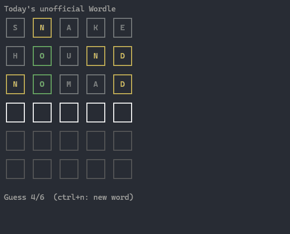
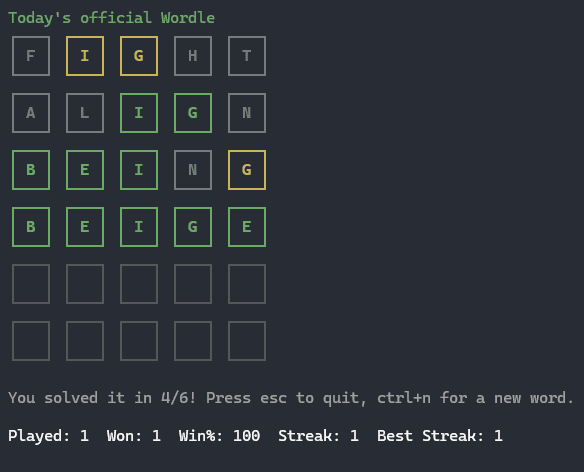
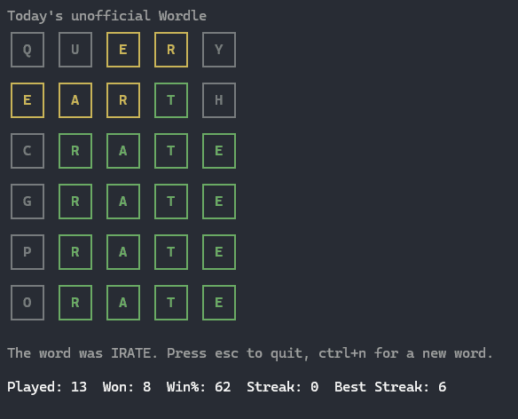

# gordle

A CLI Wordle client written in Go.

## Screenshots







## Installation

If you have Go installed:

```bash
go install github.com/bur4ky/gordle@latest
```

Or download a prebuilt version from the [latest release](https://github.com/bur4ky/gordle/releases/latest).

## Controls

Type letters and press `Enter` to submit a guess. `Backspace` removes a letter. `Ctrl+N` starts a new game. `Esc` or `Ctrl+C` exits.

Your daily game is saved automatically, so you can close gordle and return to it later without losing your progress. Statistics and streaks are saved as well.

gordle uses the New York Times Wordle of the Day if it hasn't been solved yet. Once it has, gordle switches to a random word from its local list.

## License

See [LICENSE](LICENSE).
